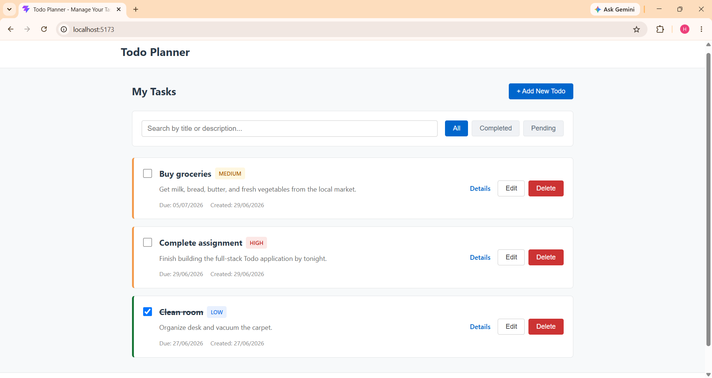
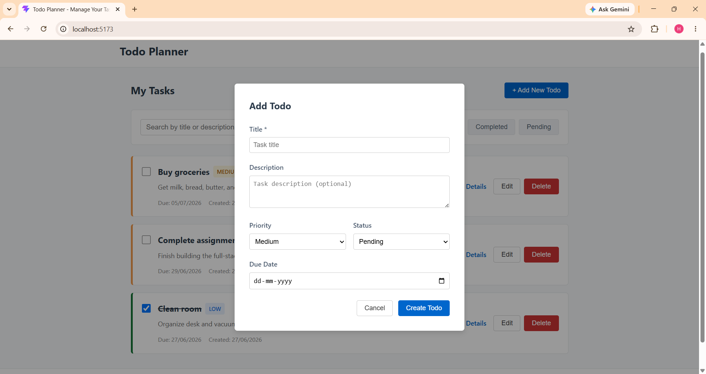
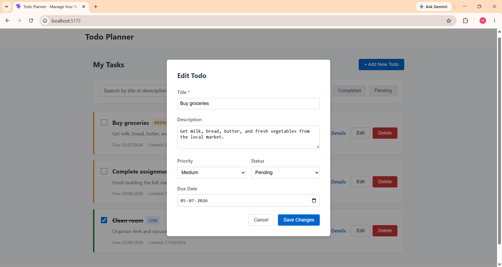
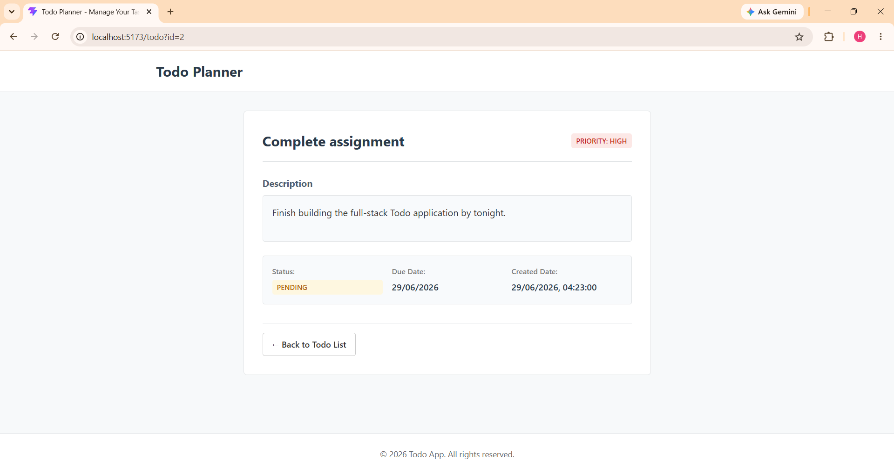
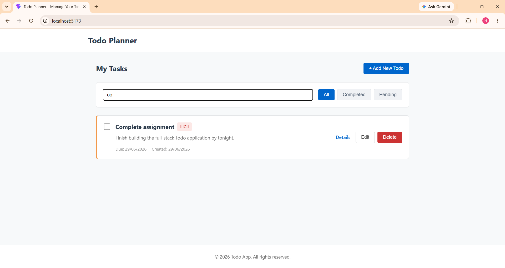

# ✅ Todo Planner — Full-Stack Task Management Application

A clean, responsive, and fully functional full-stack **Todo application** built with **React** on the frontend and **Node.js/Express** on the backend. It enables users to create, read, update, and delete tasks with support for priority levels, due dates, status tracking, real-time search, and status-based filtering — all persisted through a lightweight JSON file database.

---

## 📋 Table of Contents

- [Features \& Functionalities](#-features--functionalities)
- [Tech Stack](#-tech-stack)
- [Project Structure](#-project-structure)
- [Installation \& Setup](#-installation--setup)
- [API Endpoints](#-api-endpoints)
- [Screenshots](#-screenshots)
- [Future Improvements](#-future-improvements)

---

## ✨ Features & Functionalities

### Frontend

- **View All Tasks** — Displays all todo cards on the main page with title, description preview, priority badge, due date, and created date.
- **Add New Todo** — Opens a modal overlay form to create a task with:
  - Title *(required)*
  - Description *(optional)*
  - Priority — `Low` | `Medium` | `High`
  - Status — `Pending` | `Completed`
  - Due Date
- **Edit Todo** — Clicking "Edit" opens the same modal pre-populated with the task's existing values for inline modification.
- **Delete Todo** — Triggers a browser confirmation dialog before permanently removing the task via the API.
- **Toggle Completion** — Checkbox on each card instantly toggles the status between `Pending` and `Completed` with a single click; the change is persisted immediately to the backend.
- **Real-Time Search** — Client-side filtering that matches the search input against both the `title` and `description` of all tasks in real-time.
- **Status Filtering** — Quick-filter buttons (`All`, `Completed`, `Pending`) to narrow the displayed task list by status.
- **Task Detail Page** — A dedicated route (`/todo?id=:id`) that fetches and displays full task metadata including title, priority badge, description, status badge, due date, and created timestamp.
- **Back Navigation** — Routing link on the detail page to navigate back to the main list view.
- **Success & Error Alerts** — Contextual feedback banners displayed after create, update, and delete operations.
- **Responsive Design** — Fully responsive layout from mobile to desktop using CSS media queries; cards, forms, and grids adapt to all screen sizes.
- **Strikethrough for Completed** — Completed tasks have their titles visually struck-through for quick visual distinction.
- **Color-Coded Priority Badges** — `High` (red), `Medium` (amber), `Low` (blue) badges for instant priority recognition.
- **Color-Coded Status Indicators** — Completed cards get a green left border; Pending cards get an orange left border.

### Backend

- **RESTful CRUD API** — Five clean endpoints covering Create, Read (all & by ID), Update, and Delete operations.
- **JSON File Persistence** — All data is stored in a `todos.json` file using Node.js `fs` APIs, ensuring data survives server restarts without needing a database.
- **Auto-Initialization** — If `todos.json` is missing or deleted, the server auto-creates it with an empty array on the next read.
- **Input Validation Middleware** — A custom `validateTodo` middleware on `POST` and `PUT` routes enforces:
  - `title` is a non-empty string
  - `status` is either `Pending` or `Completed`
  - `priority` is one of `Low`, `Medium`, or `High`
  - `dueDate` (if provided) is a valid date string
- **Auto-Generated IDs** — Unique integer IDs are assigned automatically starting from `1`, incremented via `Math.max`.
- **Auto-Generated Timestamps** — `createdDate` is set to the current ISO timestamp on task creation.
- **CORS Enabled** — Configured with `cors` middleware to allow cross-origin requests from the frontend dev server.
- **Structured Error Responses** — Returns descriptive JSON error messages with appropriate HTTP status codes (`400`, `404`, `500`).

---

## 🛠 Tech Stack

| Layer | Technology | Purpose |
| :--- | :--- | :--- |
| **Frontend Framework** | React 19 | Component-based UI |
| **Build Tool** | Vite 8 | Fast dev server & bundler |
| **Routing** | React Router v7 | Client-side page navigation |
| **HTTP Client** | Axios | API communication |
| **Backend Runtime** | Node.js | Server-side JavaScript |
| **Backend Framework** | Express 4 | REST API routing & middleware |
| **Data Storage** | JSON file (`todos.json`) | Lightweight file-based persistence |
| **Styling** | Vanilla CSS | Responsive, hand-crafted styles |
| **Linting** | oxlint | Code quality checks |

---

## 📁 Project Structure

```
Challenge2/
├── backend/
│   ├── server.js              # Express server — routes, middleware, CRUD logic
│   ├── todos.json             # JSON file database (auto-created at runtime)
│   └── package.json           # Backend dependencies & scripts
│
├── frontend/
│   ├── index.html             # HTML entry point with meta tags & SEO
│   ├── vite.config.js         # Vite bundler configuration
│   ├── package.json           # Frontend dependencies & scripts
│   ├── public/
│   │   ├── favicon.svg        # App favicon
│   │   └── icons.svg          # SVG icon sprites
│   └── src/
│       ├── main.jsx           # React DOM entry point
│       ├── App.jsx            # Root component with React Router setup
│       ├── index.css          # Global responsive styles
│       ├── assets/
│       │   └── react.svg      # React logo asset
│       └── pages/
│           ├── TodoList.jsx   # Main page — task list, search, filters, add/edit modal
│           └── TodoDetail.jsx # Detail page — single task view via /todo?id=:id
│
├── README.md                  # Project documentation (this file)
├── FEATURES.md                # Detailed features & component guide
└── API.md                     # Full API endpoint documentation with examples
```

---

## 🚀 Installation & Setup

### Prerequisites

- [Node.js](https://nodejs.org/) v16 or higher
- npm (comes with Node.js)

### 1. Clone the Repository

```bash
git clone https://github.com/Harini-Venkatesan08/Todo_application.git

cd Todo_application
```

### 2. Backend Setup

```bash
cd backend
npm install
npm start
```

The backend server will start on **http://localhost:5000**.

### 3. Frontend Setup

Open a **new terminal** window:

```bash
cd frontend
npm install
npm run dev
```

The frontend dev server will start on **http://localhost:5173** (or another port shown in the terminal).

### 4. Open the App

Navigate to **http://localhost:5173** in your browser. Make sure the backend is running before using the app.

---

## 🔌 API Endpoints

Base URL: `http://localhost:5000`

| Method | Endpoint | Description | Request Body |
| :--- | :--- | :--- | :--- |
| `GET` | `/todos` | Retrieve all todos | — |
| `GET` | `/todos/:id` | Retrieve a single todo by ID | — |
| `POST` | `/todos` | Create a new todo | `{ title, description?, priority?, status?, dueDate? }` |
| `PUT` | `/todos/:id` | Update an existing todo | `{ title, description?, priority?, status?, dueDate? }` |
| `DELETE` | `/todos/:id` | Delete a todo by ID | — |

### Sample Request — Create a Todo

```bash
curl -X POST http://localhost:5000/todos \
  -H "Content-Type: application/json" \
  -d '{
    "title": "Buy groceries",
    "description": "Get milk, bread, and eggs",
    "priority": "Medium",
    "status": "Pending",
    "dueDate": "2026-07-05"
  }'
```

### Sample Response

```json
{
  "id": 1,
  "title": "Buy groceries",
  "description": "Get milk, bread, and eggs",
  "status": "Pending",
  "priority": "Medium",
  "dueDate": "2026-07-05",
  "createdDate": "2026-06-29T06:12:00.000Z"
}
```

> 📖 For full request/response schemas, validation rules, and error examples, see [API.md](API.md).

---

## 📸 Screenshots

> Add screenshots of your application below.

| View | Screenshot |
|------|------------|
| **Todo List (Main Page)** |  |
| **Add Todo** |  |
| **Edit Todo** |  |
| **Task Detail Page** |  |
| **Search & Filter** |  |

---

## 🔮 Future Improvements

- [ ] **User Authentication** — Add login/signup with JWT-based auth to support multi-user task management.
- [ ] **Database Integration** — Replace JSON file storage with MongoDB or PostgreSQL for production-grade persistence and scalability.
- [ ] **Drag & Drop Reordering** — Allow users to reorder tasks by dragging and dropping cards.
- [ ] **Due Date Reminders** — Highlight overdue tasks in red and show upcoming deadline warnings.
- [ ] **Categories / Tags** — Support grouping tasks with custom labels or color-coded tags.
- [ ] **Dark Mode** — Add a toggleable dark theme for improved accessibility and user preference.
- [ ] **Pagination / Infinite Scroll** — Handle large task lists with paginated API responses.
- [ ] **Sort Options** — Sort tasks by priority, due date, created date, or alphabetical order.
- [ ] **Bulk Actions** — Select multiple tasks to delete or mark as completed in one action.
- [ ] **Subtasks / Checklists** — Allow nested checklist items within a parent task.
- [ ] **Export / Import** — Export tasks as CSV or JSON and import from external files.
- [ ] **Deployment** — Deploy the frontend to Vercel/Netlify and the backend to Render/Railway.
